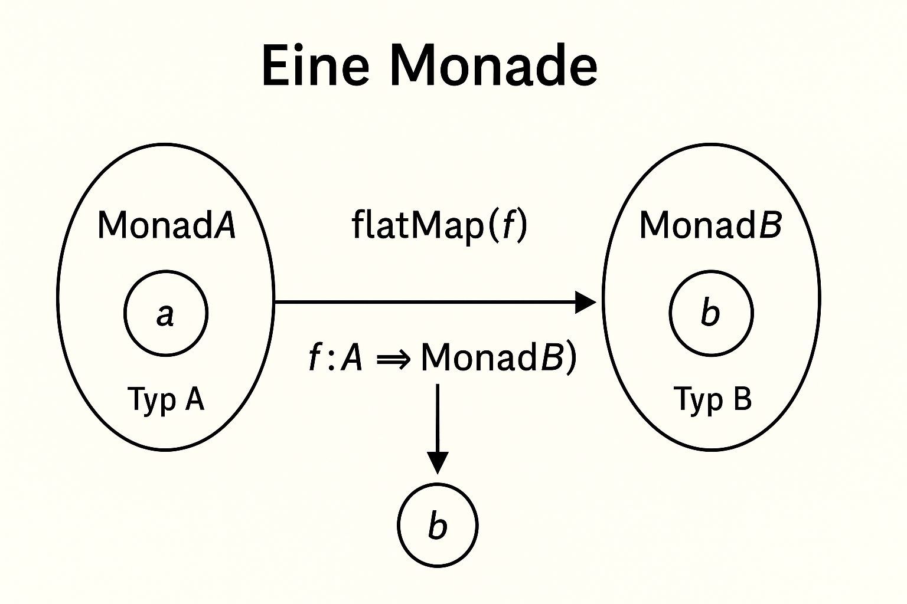

Werte, die in einem Kontext gespeichert sind 
- Datencontiner mit Rgelen 
    - Erlaubte Werte in einen Kontext zu verpacken 
    - Verkette Berechnungen auf die Werte durchzufuhren 


在 Scala 中，**Monad（单子）** 是函数式编程中一个非常核心的概念，用来封装计算过程中的“上下文”——比如可能失败的计算、异步计算、可选值等等。虽然它听起来抽象，但你已经在用它了，比如 `Option`、`Future`、`Either` 这些类型其实就是 Monad。

一个 **Monad** 是一种**数据类型**，它实现了以下两个操作：
1. `unit`（也叫 `pure` 或 `return`）：  
    把一个普通值放入 monad 中 —— 在 Scala 里是用 `Some(x)`、`Future(x)` 等。
2. `flatMap`：  
    把 monad 包裹的值**展开**出来，用某个函数处理，然后**重新包裹**进 monad。




```
val opt = Some(2)

// 用 flatMap 处理包裹在 Option 里的值
val result = opt.flatMap(x => Some(x * 10))
// result 是 Some(20)

```

- `Some(2)` 是一个 Monad
- `flatMap` 是在上下文中应用函数（函数返回一个新的 Option）
- 处理完后仍然是 Option 类型（保持“结构”）


Monad 的意义
- **避免嵌套的结构**（用 `flatMap` 代替嵌套的 `match`）    
- **统一处理链式计算中的副作用**（如失败、缺值、异步等）
- **可组合**：Monad 让你把多个复杂计算用简单的方式组合在一起


关键性质（Monaden-Gesetze）：
1. **左单位元**：`pure(x).flatMap(f) == f(x)`
2. **右单位元**：`m.flatMap(pure) == m`
3. **结合律**：`m.flatMap(f).flatMap(g) == m.flatMap(x => f(x).flatMap(g))`


# 1 Beispiel

```scala
  
def half(x: Int): Option[Int] =  
  if (x % 2 == 0) Some(x / 2) else None  
  
val numbers = List(2, 3, 4, 5, 6)  
  
val result1 = numbers.map(half)  
  
// data type of result1 : List[Option[Int]] = List(Some(1), None, Some(2), None, Some(3))  
  
  
val result2 = numbers.flatMap(half)  
// flatMap : // wendet die Funktion `half` auf jedes Element der Liste an und flacht das Ergebnis ab, indem es die `None`-Werte entfernt.    FlatMap kombiniert die Schritte `map` und `filter` in einem Schritt..   FlatMap flat the option // data type of result2 : List[Int] = List(1, 2, 3)
```

