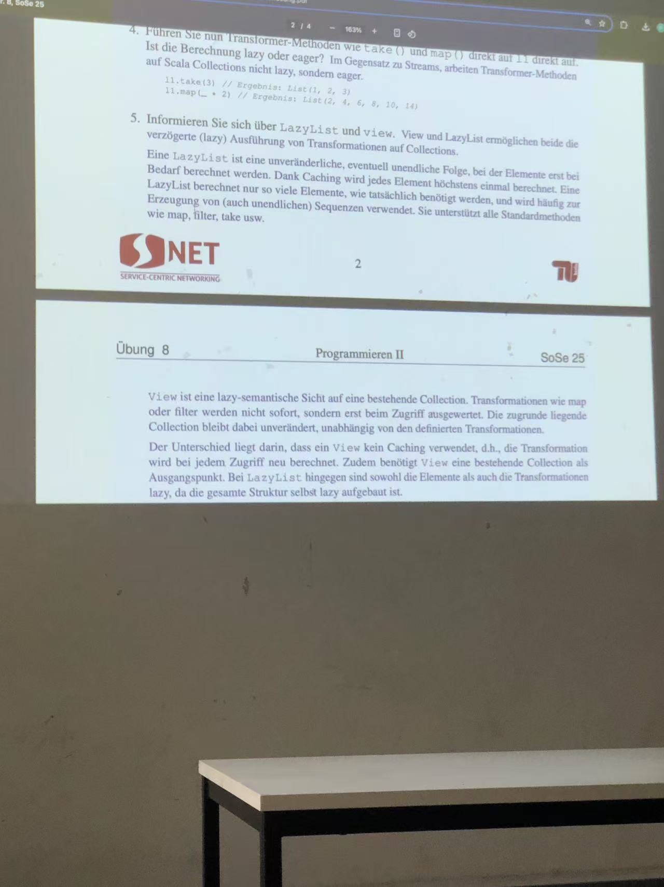

immutable and mutable in Collection 

|特性|Mutable（可变）集合|Immutable（不可变）集合|
|---|---|---|
|含义|集合的内容可以随时更改|集合创建后不能更改内容|
|修改操作|支持如 `add()`, `remove()` 等操作|所有修改操作都会抛出异常|
|常见用途|动态数据处理|常量集、不变数据、防止外部修改|


immutable collection 可以返回的是 原来的 collection 的一个复制品 


# 1 Lazylist and View 
informieren Sie sich über LazyList und view.


| 特性                | `LazyList`                             | `View`                          |
| ----------------- | -------------------------------------- | ------------------------------- |
| 惰性求值              | ✅ 是                                    | ✅ 是                             |
| 结果缓存（memoization） | ✅ 是                                    | ❌ 否                             |
| 是否可无限             | ✅ 适合                                   | ❌ 不适合（需要底层集合）                   |
| 适用对象              | 生成式结构（如 from、unfold）                   | 变换已存在集合                         |
| 支持操作              | 类似 `List` 的方法（`map`, `filter`, `take`） | 支持几乎所有集合操作                      |
| 性能                | 一次构建，重复使用                              | 一次构建，重复计算（如 `map(_*2)` 会每次重新计算） |
| 用例                | 惰性流、无限序列、数据流                           | 惰性中间变换（性能优化）                    |





## 1.1 Lazylist

`LazyList` 是 Scala 中一种 **完全惰性** 的链表替代旧的 `Stream`（从 Scala 2.13 起被引入），支持 **无限集合**。

val naturals = LazyList.from(1)  // 无限流: 1, 2, 3, ...

- 只有在真正访问元素时，才会进行计算
    
- 已计算过的值会被缓存（memoization）

```
val lazyList = LazyList.from(1).map(_ * 2)  // 未触发计算
lazyList.take(5).toList                    // 触发并计算前5个：[2, 4, 6, 8, 10]

```


## 1.2 View 

`View` 是一种 **惰性转换视图**，用于对已有集合执行操作（如 `map`、`filter`）时**不立即执行操作**，直到真正访问元素为止。

- 不会缓存结果（无 memoization）
    
- 常用于临时懒变换，不适合无限集合

```
val list = List(1, 2, 3, 4)
val view = list.view.map(_ * 2)     // 未执行 map
val result = view.take(2).toList    // 执行 map 只计算前2个：[2, 4]

```


# 2 Scala Collections und Transformer-Methoden


1. Erläutern Sie den Unterschied zwischen mutable und immutable Collections.
2. Im Scala-Worksheet worksheet.sc sind zwei Listen l1 und l2 gegeben. Dabei ist l1 vom Typ `List[Int] `und l2 vom Typ `ListBuffer[Int]`. Die beiden Listen bestehen aus den Zahlen 1 bis 7, wobei die 6 fehlt.
(a) Welche der beiden Listen ist mutable und welche immutable?
(b) Versuchen Sie in beiden Listen die 6 nachträglich am Ende der Liste hinzuzufügen
(c) Versuchen Sie aus beiden Listen die 4 zu löschen.

3. Konvertieren Sie l1 aus Aufgabe 1 in einen Stream. Was fällt sofort auf?
4. Führen Sie nun Transformer-Methoden wie take() und map() direkt auf l1 direkt auf.
Ist die Berechnung lazy oder eager?
5. Informieren Sie sich über LazyList und view.


```scala
import scala.collection.View  
import scala.collection.mutable.ListBuffer  
import scala.collection.immutable.List  
import scala.collection.immutable.LazyList  
// scala sdk 2.13.14  
  
// Gegeben: Zwei Listen mit den Zahlen 1 bis 7, ohne die 6  
// l1 ist eine unveränderliche Liste, l2 ist eine veränderliche Liste  
val l1: List[Int] = List(1, 2, 3, 4, 5, 7)  
val l2: ListBuffer[Int] = ListBuffer(1, 2, 3, 4, 5, 7)  
  
  
l1:+6 // liefert neue Liste, die alte Liste l1 mit 6 am Ende, da is immutable.  
println(l1) // List(1, 2, 3, 4, 5, 7)  
  
l2.addOne(6) // Fügt 6 an das Ende der Liste l2 an, da l2 mutable ist.  
println(l2) // ListBuffer(1, 2, 3, 4, 5, 7, 6)  
  
l1.slice(0, 3)++l1.slice(4,6) // Erstellt eine neue Liste, die die ersten 3 Elemente von l1 und die letzten 2 Elemente von l1 enthält.  ++ ist eine Verkettung von Listen., + does not work on List  
l1.toString() // l1 ist unveränderlich, daher bleibt sie unverändert.  
  
  
l2.remove(5) // Entfernt das Element an Index 5 aus l2, was die 6 ist.  
println(l2) // ListBuffer(1, 2, 3, 4, 5, 7)  
  
  
l1.filter(x=>x%2==0) // Filtert die Elemente von l1, die gerade sind. Gibt eine neue Liste zurück.  
  
  
l1.take(3) // Nimmt die ersten 3 Elemente von l1. Gibt eine neue Liste zurück.  laziness oder eager evaluation: List in Scala is （eager）  
l1.map(_*2) // Multipliziert jedes Element von l1 mit 2. Gibt eine neue Liste zurück. laziness oder eager evaluation: List in Scala is （eager）  
  
  
// please use scala sdk 2.13.14 to fix this problem  
l1.to(LazyList).take(3).toList // Nimmt die ersten 3 Elemente von l1 als LazyList. Gibt eine LazyList zurück. Ergebnis: LazyList(1, 2, 3) // LazyList ist eine lazy collection, die Elemente nur bei Bedarf berechnet.  
l1.view.take(3).toList // ergebnisse: SeqView[Int] = SeqView(1, 2, 3) // Nimmt die ersten 3 Elemente von l1 als View. Gibt eine View zurück.
```


# 3 fold() und reduce() 


Was ist der Unterschied zwischen fold() und reduce() in Scala?

|Aspekt|`fold`|`reduce`|
|---|---|---|
|Startwert|✅ Benötigt einen expliziten Startwert|❌ Kein Startwert – nimmt erstes Element|
|Funktionstyp|`(acc, elem) => ...`|`(elem1, elem2) => ...`|
|Leere Collection|✅ Kein Problem (liefert Startwert)|❌ Laufzeitfehler (`NoSuchElementException`)|
|Rückgabetyp|Kann anderer Typ als Elemente sein|Muss gleicher Typ wie Elemente sein|
|Robustheit|✅ Sicher|❌ Unsicher bei leeren Collections|

fold() ist viel sicher als reduce 


## 3.1 Beispiel 

```scala

val l1: List[Int] = List(1, 2, 3, 4, 5, 7)

//2. Nehmen Sie die Liste l1 aus Aufgabe 1 und bilden Sie die Summe mittels reduce().
//  Hinweis: Nutzen Sie hier nicht sum().


// val sumL1 = l1.reduce((a, b) => a + b) // sumL1 ist die Summe aller Elemente in l1.
val sumL1 = l1.reduce(_ + _)  // _ ist ein Platzhalter für die Parameter der Funktion, die an reduce() übergeben wird.  erst _ is placeholder for the first parameter a , second _ is placeholder for the second parameter b


//3. Ist reduce() äquivalent zu reduceLeft() oder reduceRight()? Gilt immer  reduceLeft() == reduceRight()? Untersuchen Sie das ganze für  l1.reduce(_ - _).

val reduceLeftResult = l1.reduceLeft(_ - _)  // Berechnet die Differenz von links nach rechts
val reduceRightResult = l1.reduceRight(_ - _)  // Berechnet die Differenz von rechts nach links


// hier exmaple for folddflet , foldright arbeiten
l1.foldLeft("")((acc, elem) => {
  println(acc+elem.toString)
  acc + elem.toString
}) // foldLeft: Startet mit einem leeren String und fügt jedes Element von l1 als String hinzu. Ergebnis: "123457", firt 1, 12, 123, ...
l1.foldRight("")((elem, acc) => {
  println(elem.toString+acc)
  elem.toString + acc
}) // foldRight: Startet mit einem leeren String und fügt jedes Element von l2 als String hinzu, aber in umgekehrter Reihenfolge. Ergebnis: "123457".  7, 57, 457, ..., 123457


// l1 : List(1, 2, 3, 4, 5, 7)
l1.foldLeft(0)(_ - _) // foldLeft: Startet mit 0 und substrakiert jedes Element von l1. Ergebnis: -22   ((((((0-1)-2)-3)-4)-5)-7
l1.foldRight(0)(_ - _) // foldRight: (1-(2-(3-(4-(5-(7-0))))))


//4. Gegeben sei l3 vom Typ List[String] mit l3 = List(“H”, “e”, “l”, “l”, “o”}.  Nutzen Sie eine geeignete fold-Methode, um die Ausgabe “Hello World!” zu erzeugen.

val l3: List[String] = List("H", "e", "l", "l", "o")
l3.fold("World!")((acc, elem) => acc + elem) // fold: Startet mit "World!" und fügt jedes Element von l3 hinzu. Ergebnis: "World!Hello"
l3.fold("World!")(_ + _) // fold: Startet mit "World!" und fügt jedes Element von l3 hinzu. Ergebnis: "World!Hello"

l3.foldLeft("World!")(_ + _) // foldLeft: Startet mit "World!" und fügt jedes Element von l3 hinzu. Ergebnis: "World!Hello"
l3.foldRight(" World! ")(_ + _) // foldRight: Startet mit "World!" und fügt jedes Element von l3 hinzu. Ergebnis: "HelloWorld!"

```

