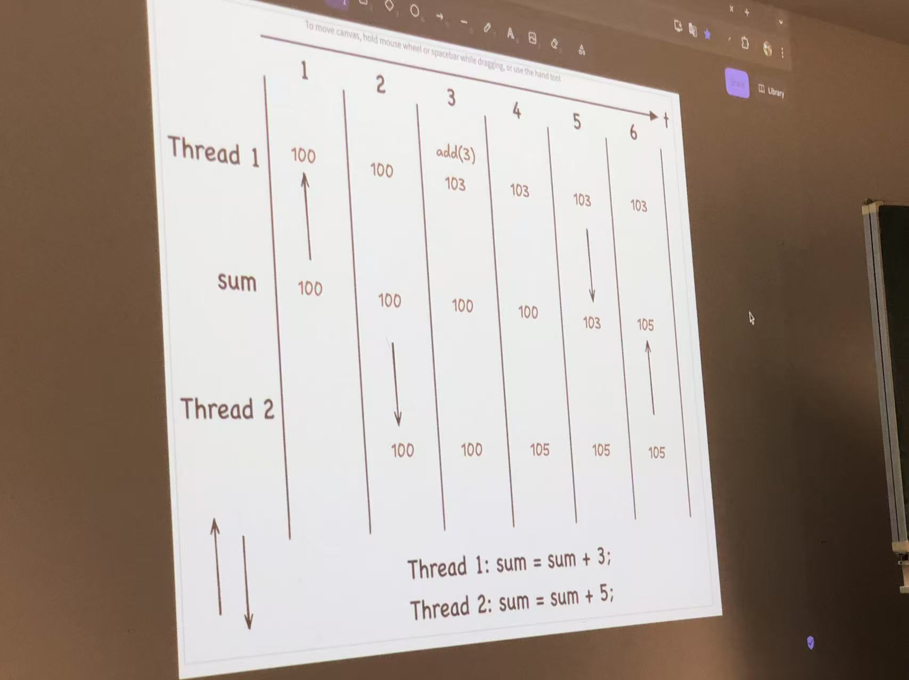
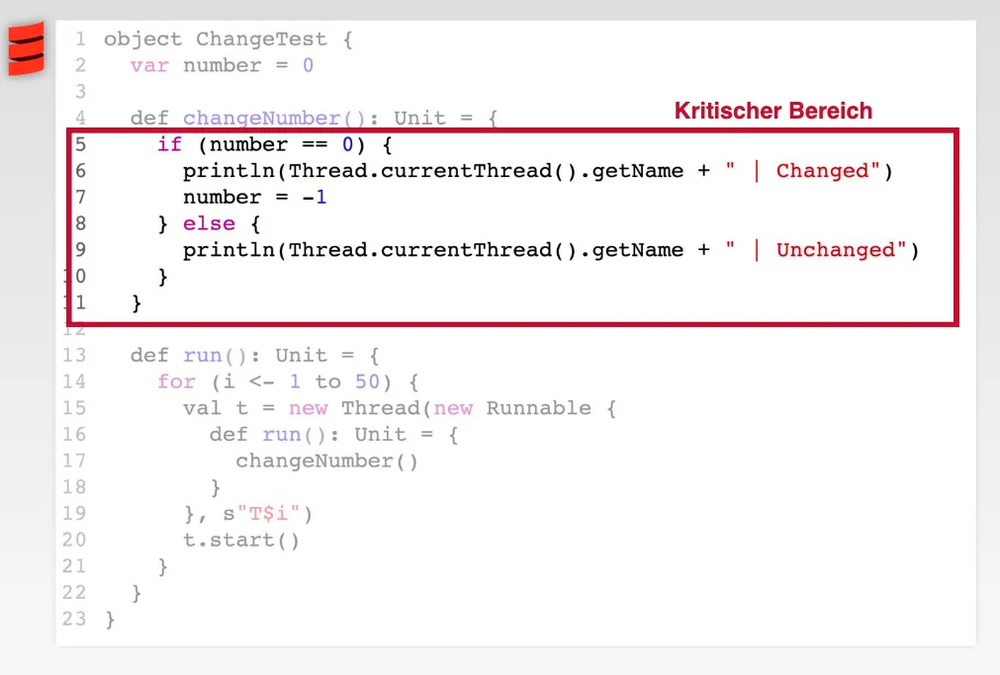
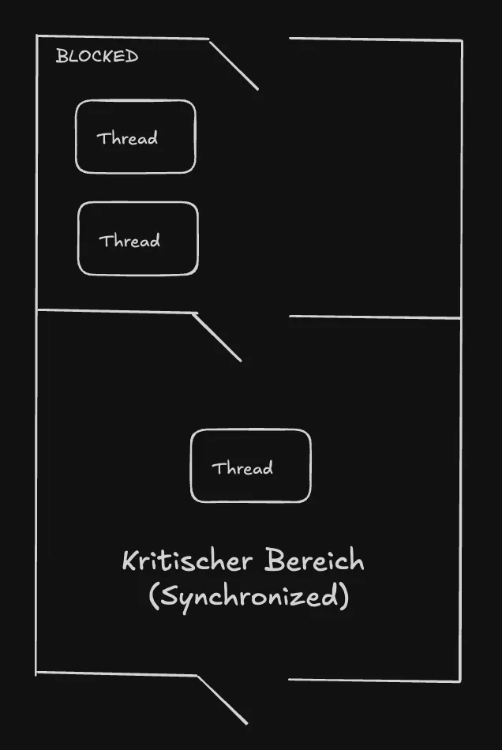
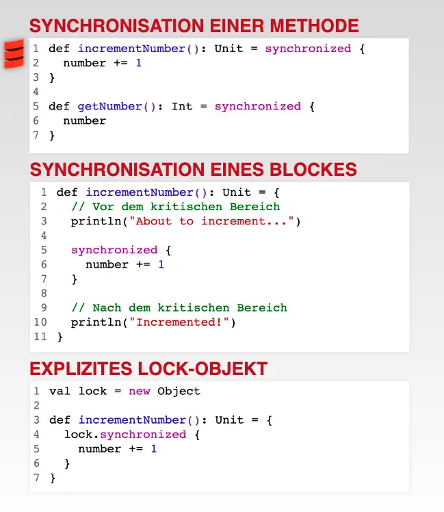
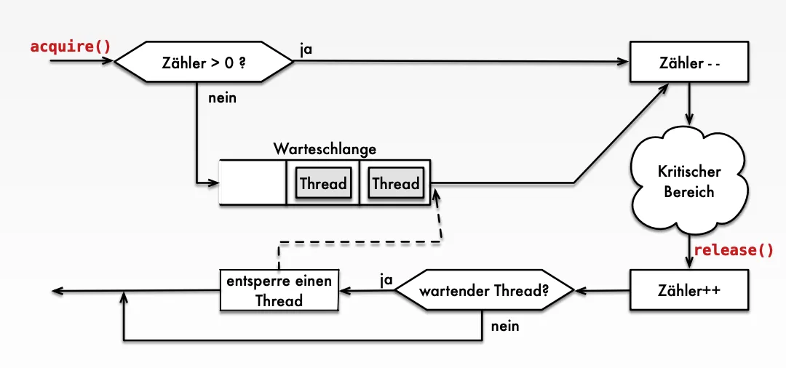

# 1 Race Conditions: Grundlagen


1. Was ist eine Race Condition?
    1. Wenn das Ergebnis von Zeitpunkt und der Reihenfolge bestimmter Ereignisse abhängt
    2. interne zwei Operation
2. Warum treten Race Conditions auf?
3. Welche Arten von Race Conditions gibt es?
4. Welche Mechanismen gibt es, um Race Conditions zu verhindern?


Das Ergebnis einer Operation hängt von den Zeitpunkten und der Reihenfolge bestimmter Ereignisse ab


## 1.1 beispiel 

6. Skizzieren Sie in der untenstehenden Abbildung, wie es im gegebenen Szenario zu einer Race Condition kommt. Gehen Sie davon aus, dass sum zu Beginn einen Wert von 100 hat:





Race Condition passiert:  Check Then Act Problem 


## 1.2 krisitische Bereich




- Zwischenergebnisse der Einzelanweisungen (auf gemeinsam genutzten Variablen) können inkonsistente Zustände darstellen, auf welche andere Threads keinen Zugriff erhalten dürfen.
- Das Ergebnis eines kritischen Bereichs darf nur als unteilbare (atomic) Einheit nach außen sichtbar werden. : nur einen Thread ist erlaubt, in xx krisitsche Bereich zu passieren 
- Verfahren zum Schützen kritischer Bereiche:
    - Semaphore
    - Monitore
    - Gegenseitiger Ausschluss


1. Ein Codeblock, der auf gemeinsam genutzte Ressourcen zugreifen 
2. Ein **kritischer Bereich** ist ein Programmabschnitt, in dem ein **Thread auf eine gemeinsame Ressource zugreift** (z. B. eine Variable, Datei oder Datenbank), und wo **gleichzeitiger Zugriff** zu **Inkonsistenzen oder Race Conditions** führen kann.  
    1. → Nur **ein Thread zur gleichen Zeit** darf diesen Bereich betreten.
3. Schutz von kritische Bereich
    1. Semaphore Monitore, gegenseitiger Ausscluss
    2. Semaphore is eine Zaehler : eine Zaehlvariable mit steuerungsfunktionen:  
    3. Semaphore: Ziel,  Ein **Semaphore** ist ein Synchronisationsmechanismus, der **Zugriff auf eine begrenzte Anzahl von Ressourcen** steuert – häufig verwendet, um den **Zugriff auf kritische Bereiche zu regeln**.
        1. bei release() eines Semaphors: Die Semaphore ZHel wird inkrementiert , nitch dekrementiert, sodass andern thread erblaut, reinzu kommen  
    4. Mintore: Sprachkonstrukt: synchronisierung von Threads 


Scla is snyschronized eine Methode von Anyref:  true 


## 1.3 Monitore

Programmiersprachliches Konstrukt zur Synchronisierung von kritischen Bereichen → Nur ein Thread an einem Zeitpunkt soll Zugriff auf einen kritischen Bereich haben


Wenn Thread in krischer Bereich ist aus, kann noch anderen Thread aus Block Bereich ins Krisitisch Breich einkommen 

- In Scala ist synchronized eine Methode von AnyRef, also der Basisklasse aller Referenztypen (vergleichbar mit java.lang.Object)
- Mit synchronized kann man entweder eine Methode oder einen Block des kapselnden Objekts sperren
- Alternativ können Methoden oder Blöcke mit einem separaten Lock-Objekt, dessen synchronized-Methode man aufruft, sperren:



synchronized : wirr synchtonized das object , das in instance geschriben werden 


---

in java 


## 1.4 Semaphore 




Ein Semaphor S ist eine ganzzahlige Zählvariable, welche mittels zweier Operationen acquire() (zum Dekrementieren) und release() (zum Inkrementieren) verändert werden kann.
- Ein Semaphor S ist eine ganzzahlige Zählvariable, welche mittels zweier Operationen acquire() (zum Dekrementieren) und release() (zum Inkrementieren) verändert werden kann.
- Der Anfangswert der Zählvariable gibt die Anzahl der Threads an, die sich gleichzeitig in einem durch S geschützten kritischen Bereich aufhalten dürfen.
-  Jede acquire()-Operation überprüft, ob ein Eintreten in den kritischen Bereich möglich ist.
- S>0: der Thread kann in den kritischen Bereich eintreten und S wird dekrementiert.
- S=0: es befindet sich bereits die zulässige Anzahl von Threads imkritischen Bereich und der aufrufende Thread muss in einer Warteschlange warten.
- Jede release()-Operation inkrementiert die Zählvariable und der erste wartende Thread (falls existent) kann in den kritischen Bereich eintreten, woraufhin S erneut dekrementiert wird.


### 1.4.1 Beispiel 

```java
import java.util.concurrent.Semaphore

object ToiletteExample {

  val semaphore = new Semaphore(1) // Nur 1 Person darf gleichzeitig rein

  def personGehtAufKlo(name: String): Unit = {
    println(s"$name möchte die Toilette betreten.")
    semaphore.acquire()
    try {
      println(s"$name ist auf der Toilette.")
      Thread.sleep(1000) // simuliert Benutzung der Toilette
      println(s"$name verlässt die Toilette.")
    } finally {
      semaphore.release()
    }
  }

  def main(args: Array[String]): Unit = {
    val names = List("Alice", "Bob", "Charlie")

    for (name <- names) {
      new Thread(() => personGehtAufKlo(name)).start()
    }
  }
}
```


# 2 Atomic Integer 

einlesen, auslesen, update 

`AtomicInteger` 是 Java 并发包中的一个类，提供了对整数的 **原子操作**，即这些操作是线程安全的，不需要使用 `synchronized` 或其他锁机制。

它可以保证多个线程同时操作一个整数变量时，不会发生竞态条件（Race Condition）


```
import java.util.concurrent.atomic.AtomicInteger

object AtomicExample extends App {
  val counter = new AtomicInteger(0)  // 初始化计数器

  def increment(): Unit = {
    val newValue = counter.incrementAndGet()  // 原子递增，返回递增后的值
    println(s"当前计数值: $newValue")
  }

  val threads = (1 to 5).map { i =>
    new Thread(() => increment())  // 创建多个线程并发调用 increment()
  }

  threads.foreach(_.start())  // 启动所有线程
  threads.foreach(_.join())   // 等待所有线程执行完成
}

```


